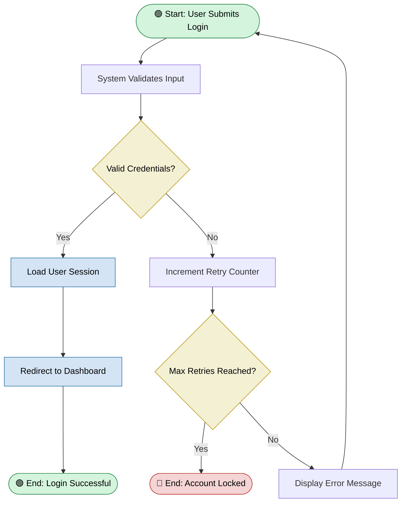
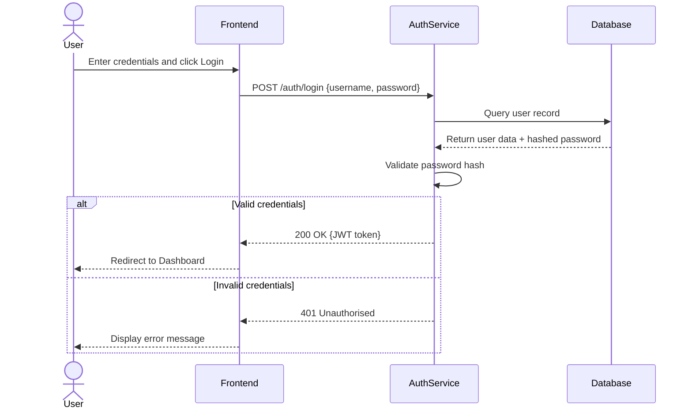
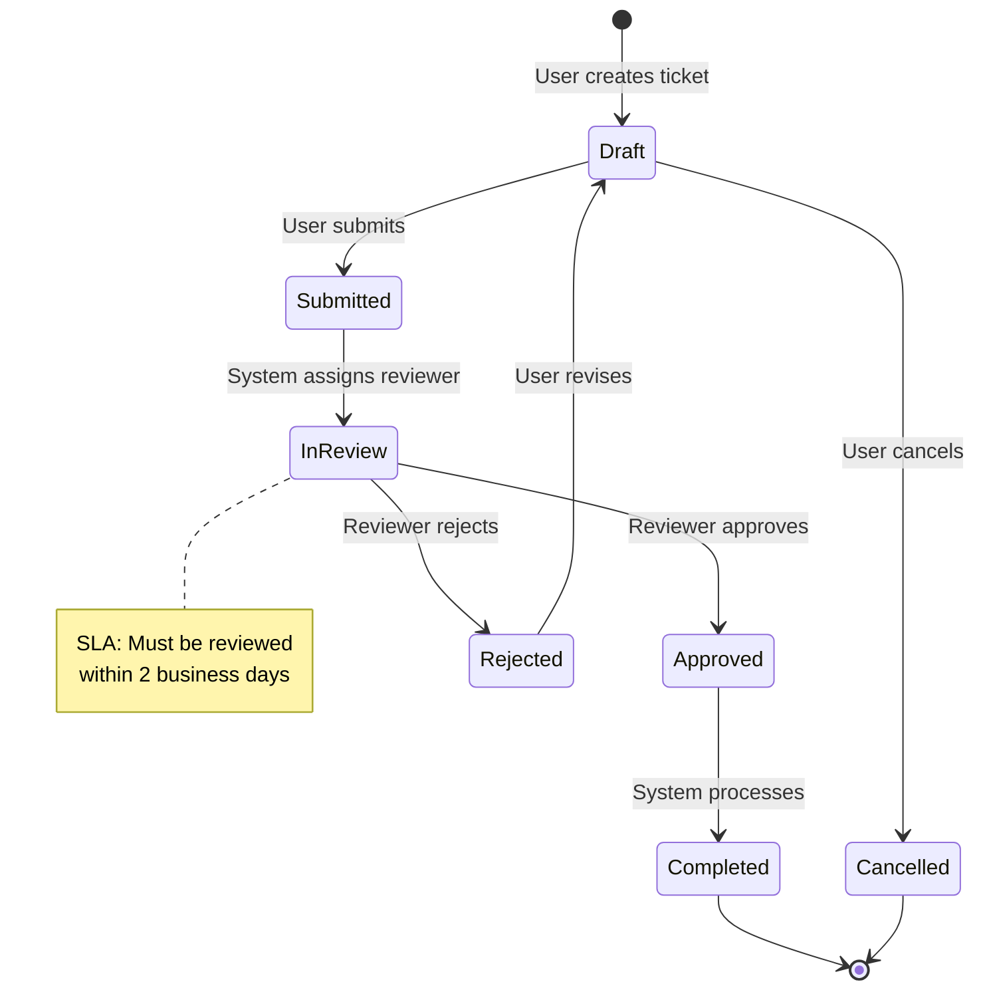
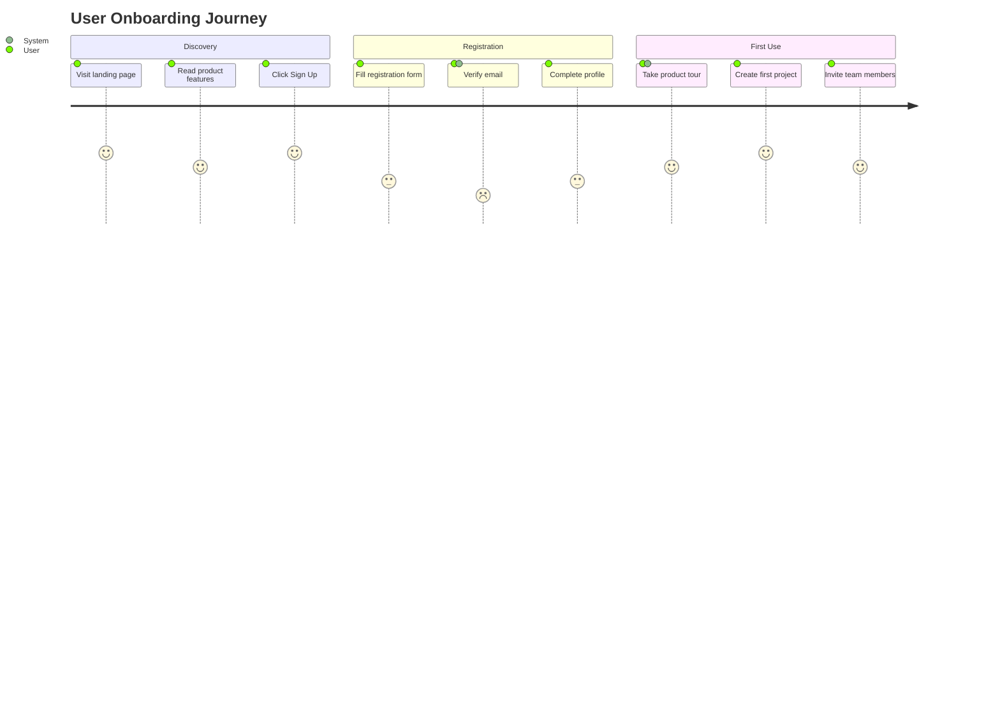
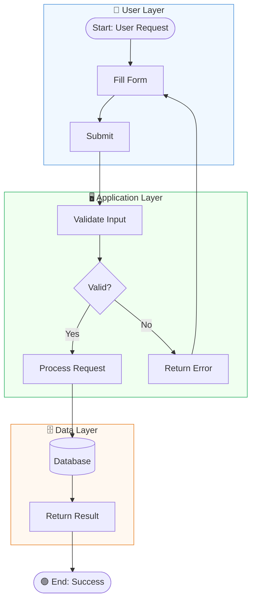

# Diagram Guide — UC2: Mermaid & Draw.io Syntax Reference

## Purpose

This guide defines the exact diagram types, syntax patterns, and style rules that the `story-diagram-generator` agent must follow when producing process diagrams. The agent must consult this file to select the correct diagram type and apply consistent formatting.

---

## Diagram Type Selection Matrix

Use this matrix to decide which diagram type to generate based on the nature of the process described in the requirements:

| Scenario | Recommended Diagram Type | Format |
|----------|--------------------------|--------|
| Linear process with decision points | Flowchart | Mermaid `flowchart TD` |
| Multiple actors interacting across time | Sequence Diagram | Mermaid `sequenceDiagram` |
| System states and transitions | State Diagram | Mermaid `stateDiagram-v2` |
| User experience / journey | User Journey | Mermaid `journey` |
| Complex enterprise process with swim lanes | Cross-functional Flowchart | Draw.io XML |
| Data pipeline or ETL process | Flowchart with subgraphs | Mermaid `flowchart TD` with `subgraph` |
| High-level system architecture overview | Architecture block diagram | Draw.io XML |

**Default rule:** When in doubt, use a **Mermaid flowchart** (`flowchart TD`). It is the most universally readable and renders natively in VS Code without saving a file.

---

## Mermaid Diagram Syntax

### 1. Flowchart (Most Common)



**Node Shape Reference:**

| Shape | Mermaid Syntax | Use For |
|-------|---------------|---------|
| Rounded rectangle | `A([text])` | Start / End events |
| Rectangle | `A[text]` | Process / Action steps |
| Diamond | `A{text}` | Decision / Gateway |
| Parallelogram | `A[/text/]` | Input / Output |
| Cylinder | `A[(text)]` | Database / Storage |
| Hexagon | `A{{text}}` | Preparation step |
| Circle | `A((text))` | Connector / Reference |

**Direction Options:**

| Code | Direction | Best For |
|------|-----------|---------|
| `TD` | Top → Down | Most processes (default) |
| `LR` | Left → Right | Pipelines, timelines |
| `BT` | Bottom → Top | Rarely used |
| `RL` | Right → Left | Rarely used |

---

### 2. Sequence Diagram

Use when **multiple actors exchange messages over time** (e.g., API calls, user-system interactions, microservice communication).



**Key Syntax Rules:**
- `->>` : Solid arrow (synchronous request)
- `-->>` : Dashed arrow (response / async)
- `actor` : Human participant (shown as stick figure)
- `participant` : System component (shown as box)
- `alt`/`else`/`end` : Conditional blocks
- `loop` : Repeating interactions
- `Note over X,Y: text` : Annotations

---

### 3. State Diagram

Use when describing **system states and what triggers transitions** between them (e.g., order status, ticket lifecycle, user account status).



---

### 4. User Journey Diagram

Use for **end-to-end user experience flows** spanning multiple touchpoints or sections of an application.



**Score meanings (1–5):** 1 = very frustrating, 5 = delightful

---

### 5. Flowchart with Subgraphs (Multi-domain Processes)

Use when a process spans **multiple systems or departments** that are better grouped visually.



---

## Draw.io XML Template

Use this template structure when generating Draw.io diagrams. Replace the cell contents with actual process steps.

```xml
<?xml version="1.0" encoding="UTF-8"?>
<mxfile host="vscode" modified="2024-01-01T00:00:00.000Z" version="21.0.0">
  <diagram name="Process Flow" id="process-flow-01">
    <mxGraphModel dx="1422" dy="762" grid="1" gridSize="10" guides="1"
                  tooltips="1" connect="1" arrows="1" fold="1"
                  page="1" pageScale="1" pageWidth="1169" pageHeight="827"
                  math="0" shadow="0">
      <root>
        <mxCell id="0" />
        <mxCell id="1" parent="0" />

        <!-- START EVENT (Green Rounded) -->
        <mxCell id="start" value="Start: [Event Name]"
                style="rounded=1;whiteSpace=wrap;html=1;fillColor=#d4f4dd;strokeColor=#2d8a4e;fontStyle=1;"
                vertex="1" parent="1">
          <mxGeometry x="400" y="40" width="160" height="50" as="geometry" />
        </mxCell>

        <!-- PROCESS STEP (Blue Rectangle) -->
        <mxCell id="step1" value="[Action / Process Step]"
                style="rounded=0;whiteSpace=wrap;html=1;fillColor=#d4e4f4;strokeColor=#2471a3;"
                vertex="1" parent="1">
          <mxGeometry x="400" y="140" width="160" height="50" as="geometry" />
        </mxCell>

        <!-- DECISION (Yellow Diamond) -->
        <mxCell id="decision1" value="[Decision / Condition?]"
                style="rhombus;whiteSpace=wrap;html=1;fillColor=#f4f0d4;strokeColor=#b7950b;"
                vertex="1" parent="1">
          <mxGeometry x="375" y="240" width="200" height="80" as="geometry" />
        </mxCell>

        <!-- END SUCCESS (Green Rounded) -->
        <mxCell id="endSuccess" value="End: [Success State]"
                style="rounded=1;whiteSpace=wrap;html=1;fillColor=#d4f4dd;strokeColor=#2d8a4e;fontStyle=1;"
                vertex="1" parent="1">
          <mxGeometry x="580" y="360" width="160" height="50" as="geometry" />
        </mxCell>

        <!-- END FAILURE (Red Rounded) -->
        <mxCell id="endFailure" value="End: [Failure State]"
                style="rounded=1;whiteSpace=wrap;html=1;fillColor=#f4d4d4;strokeColor=#c0392b;fontStyle=1;"
                vertex="1" parent="1">
          <mxGeometry x="180" y="360" width="160" height="50" as="geometry" />
        </mxCell>

        <!-- CONNECTIONS (Arrows) -->
        <mxCell id="e1" style="edgeStyle=orthogonalEdgeStyle;" edge="1" source="start" target="step1" parent="1">
          <mxGeometry relative="1" as="geometry" />
        </mxCell>
        <mxCell id="e2" style="edgeStyle=orthogonalEdgeStyle;" edge="1" source="step1" target="decision1" parent="1">
          <mxGeometry relative="1" as="geometry" />
        </mxCell>
        <mxCell id="e3" value="Yes" style="edgeStyle=orthogonalEdgeStyle;" edge="1" source="decision1" target="endSuccess" parent="1">
          <mxGeometry relative="1" as="geometry" />
        </mxCell>
        <mxCell id="e4" value="No" style="edgeStyle=orthogonalEdgeStyle;" edge="1" source="decision1" target="endFailure" parent="1">
          <mxGeometry relative="1" as="geometry" />
        </mxCell>

      </root>
    </mxGraphModel>
  </diagram>
</mxfile>
```

---

## Colour Coding Standard

All diagrams must use this colour palette consistently:

| Node Type | Fill Colour | Stroke Colour | Hex Fill | Hex Stroke |
|-----------|-------------|---------------|----------|------------|
| Start / Success End | Green | Dark Green | `#d4f4dd` | `#2d8a4e` |
| Failure / Error End | Red | Dark Red | `#f4d4d4` | `#c0392b` |
| System / App Action | Blue | Dark Blue | `#d4e4f4` | `#2471a3` |
| Decision / User Action | Yellow | Dark Yellow | `#f4f0d4` | `#b7950b` |
| External System | Grey | Dark Grey | `#e8e8e8` | `#7f8c8d` |
| Database / Storage | Orange | Dark Orange | `#fdebd0` | `#e67e22` |
| Subgraph / Swim Lane | Light Blue | Medium Blue | `#f0f8ff` | `#4a90d9` |

---

## Common Mistakes to Avoid

| ❌ Mistake | ✅ Correct Approach |
|-----------|-------------------|
| Diamond nodes without labelled branches | Always label `Yes`/`No` or condition text on every branch |
| More than 15 nodes in one diagram | Split into Overview + Detail sub-diagrams |
| Mixed arrow styles in Mermaid sequence | Use `->>` for requests, `-->>` for responses consistently |
| No start or end nodes | Every diagram must have explicit start `([Start])` and end `([End])` nodes |
| Unlabelled subgraphs | Every subgraph must have a descriptive title |
| Missing colour styles on key nodes | Always apply `style` rules to Start, End, and Decision nodes at minimum |
| Using `graph` instead of `flowchart` | Always use `flowchart TD` — `graph` is deprecated in newer Mermaid versions |
